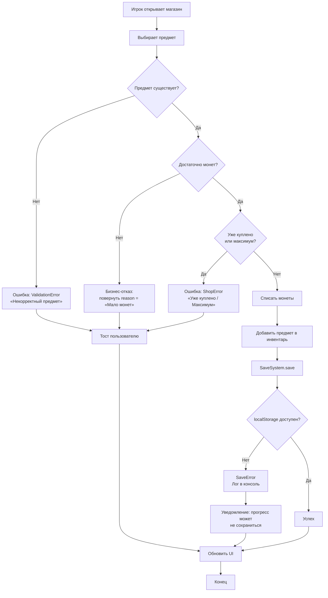

# Activity Diagram: Покупка в магазине с обработкой ошибок

## Пояснение

На диаграмме чётко разделены два пути:
- **Ошибки (throw)** — узлы E1, E3, E5 (ValidationError, ArtifactError).
- **Бизнес-отказы (return reason)** — узел E2 («Мало монет»).

Первые ловятся `try/catch`, вторые обрабатываются как обычный результат функции.