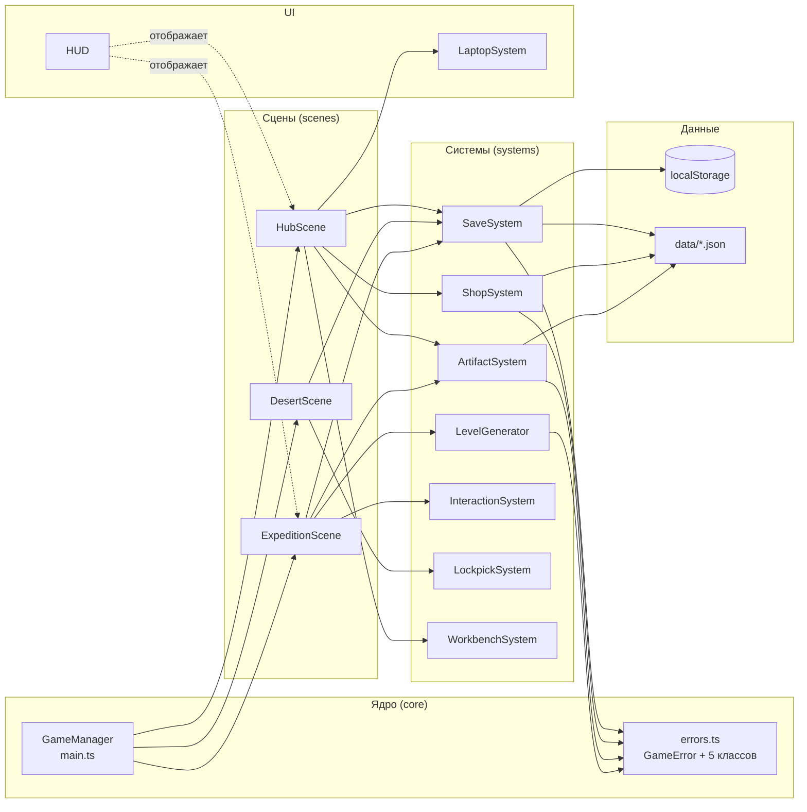

## 📄 Часть 5. Создай `docs/diagrams/component-updated.md`

Component Diagram с `errors.ts`.

```markdown
# Component Diagram (обновлён под день 7)



## Что нового

- **`errors.ts`** вынесен как отдельный компонент ядра.
- **Все системы** зависят от `errors.ts`, но используют разные классы:
  - `ShopSystem` → `ValidationError`, `ShopError`
  - `ArtifactSystem` → `ArtifactError`
  - `SaveSystem`, `LevelGenerator` → пока не используют, зависимость зарезервирована